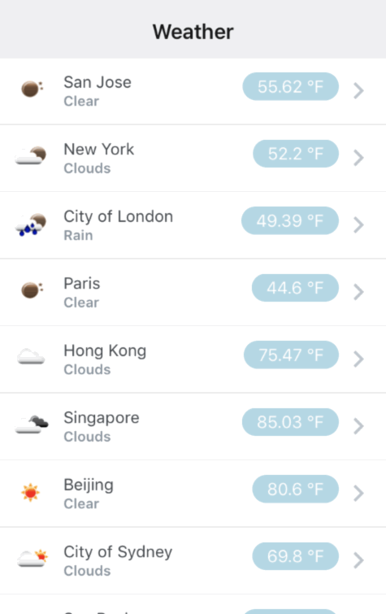

# React Native 101 Class

Welcome to React Native 101! In this class we will learn more about React Native and how it can be used to build a simple mobile app.

# What is React Native?

React Native is a framework for building native applications using React. React Native apps are written in JavaScript and can target iOS and Android devices.

  - You will be writing mostly JavaScript code. Your code along with any dependencies is then packaged into a single JavaScript file which is then bundled with the native app.

  - During development, we will be downloading the JS bundle from our dev machine and into the native app, as this will allow us to quickly iterate on the app.

  - Your JavaScript code will be executed in a dedicated JavaScript thread, which will communicate with the main UI thread via a bridge.
  This is a two-way street, meaning that events from the native side (such as touches and gestures) are also sent back to the JS thread.

  - You can still write native code, if needed.

> You can learn more about React Native at http://facebook.github.io/react-native/

# Prerequisites

This class assumes some basic knowledge of modern JavaScript. React Native supports most ES6 language features, but for simplicity we will try to stick to ES5 whenever possible.

  - [Node v6](./InstallingNode.md) is required.

  - You should also install the Expo app on your device. This will make it easier for you to preview your app. You can download the Expo app here: https://expo.io

  - Finally, join our WiFi network, "FBOpenSource". The password is "opensource".

# Building an app using React Native

Today we will be building a simple weather app using React Native.

The weather app will consist of two screens:

 - The first screen will display a list of cities. Each item in the list will display the name of the city, and some basic weather information (temperature, conditions).

 - The second screen will display additional details such as humidity, wind speed, and minimum/maximum temperatures for the day.

The app will look something like this when finished:

  

The app will use current weather data provided by the [Open Weather Map API](https://openweathermap.org/api).

At the end of this class, you will have learned the following skills:

 - Setup and configuration of a basic React Native app
 - How to run a React Native app on a device
 - Writing reusable, customizable React components
 - Composing multiple React components to build complex interfaces
 - Building lists in React Native
 - Fetching data from remote endpoints
 - Navigating between multiple screens

## Using this document

We will be covering a lot of ground today. Your instructor will copy and paste code from this document into the app throughout the class. You can tell which step we're at by looking at the comments that get pasted along with the code.

<!--
When copy/pasting code directly from this document, make sure to only copy the text INSIDE the triple tickmarks (``` and ```). These denote the beginning and the end of a code block. If you're copying from a rendered version of this document, you don't need to worry about this (the code blocks should be obvious, and you would not be able to see this comment, anyway).
-->

I'll ask you to run a command at various points in my class. These commands can be run in a Terminal (MacOS), Command Prompt (Windows), or shell (Linux).

The [`WeatherApp` directory](https://github.com/hramos/ReactNativeClass/tree/master/WeatherApp) in this repo contains the final app code. Feel free to refer to it if you get lost or you just want to see the final app we're working towards.

If you want to follow along with the instructor, from scratch, then read on for a detailed list of steps.

## Table of Contents

  - Step 1: Install "Create React Native App"
  - Step 2: Create a new React Native app
  - Step 3: Run your app on a device
  - Step 4: Experiment with Live Reloading
  - Step 5: Create a custom component
  - Step 6: Create a scrollable list
  - Step 7: Populate the list
  - Step 8: Customize our list of cities
  - Step 9: Fetching data from the network
  - Step 10: Navigating between screens
  - Homework

---

# Step 1: Install "Create React Native App"

Run the following command:

```bash
npm install -g create-react-native-app
```


---

# Step 2: Create a new React Native app

Run the following commands:

```bash
create-react-native-app MyWeatherApp
```

At this point, the create-react-native-app (CRNA) command line utility will create a basic directory structure for your application and it will also download any dependencies.


---

# Step 3: Run your app on a device

Once CRNA has finished setting up your app, navigate to the newly created folder:

```bash
cd MyWeatherApp
```

Then run the following command to start the packager:

```bash
npm start
```

Now, open the Expo app on your phone and scan the QR code that should be visible on your screen. You should now see a very basic app on your phone. Congrats, you're now running your very first React Native app on an actual device!

> Tip: You can scan your instructor's QR code, too. This way, you can run the instructor's app on your device and lay back as they build the app for you.


> Refer to the README.md file created by CRNA for more information on all the available commands.


---

# Step 4: Experiment with Live Reloading

The app that is currently running on your device is fully native. What you're seeing now on screen is made up entirely of native UI components. As you now know, this UI is controlled by JavaScript code. That means that we can, at any point, refresh and get the latest version of our JavaScript code. And we can do this without having to compile and install a new version of our app on the device.

Before we make any changes, let's take a minute to understand how our (very basic) interface is defined right now.

Open `App.js` and look for the `render()` method inside the `App` class. It looks something like this:

```javascript
render() {
  return (
    <View style={styles.container}>
      <Text>Open up App.js to start working on your app!</Text>
      <Text>Changes you make will automatically reload.</Text>
      <Text>Shake your phone to open the developer menu.</Text>
    </View>
  );
}
```

Here we can see that our component is rendering a `View` component that contains three `Text` components.

A `View` is a built-in React Native component that works much like a `div` in the web. It maps to a `UIView` on iOS, or `android.view` on Android. The `View` component will serve as a building block for most of your React Native components.

A `View` can be styled. In the example above, we are using a style that has been defined at the bottom of our `App.js` file using the `StyleSheet` API:

```javascript
const styles = StyleSheet.create({
  container: {
    flex: 1,
    backgroundColor: '#fff',
    alignItems: 'center',
    justifyContent: 'center',
  }
});
```

The style names and values usually match how CSS works on the web, except names are written using camel casing, e.g `backgroundColor` rather than `background-color`. The style prop can also be a plain old JavaScript object, as we'll see below.

The `Text` component allows you to display text. It can be styled, much like a `span` in the web.

Go ahead and try adding some styles to one of our `Text` components:

```javascript
<Text style={{fontSize: 18}}>
  Changes you make will automatically reload.
</Text>
```

Save your changes, and watch as your app automatically updates itself.


> Code for Step 4 can be found [here](https://github.com/hramos/ReactNativeClass/blob/master/Steps/App-Step4-LiveReloading.js).

> Learn more about styles here: https://facebook.github.io/react-native/docs/style.html


---

# Step 5: Create a custom component

In order to build a more complex app, we'll need to go beyond the simple default `App` component. This being a React application, we can progressively create new components that can be reused across our application.

The application we're building consists mainly of a vertical list of cities. Each item in the list will display the name of a city, as well as some basic weather data for that city. We can start building our application by creating a simple component that will display the data for a given city.

Let's name this new component, "CityWeather":

```javascript
class CityWeather extends React.Component {
  render() {
    return (
      <View
        style={{
          flexDirection: 'row',
          padding: 10,
          margin: 10,
        }}
      >
        <Text style={{ width: 100 }}>
          City
        </Text>
        <Text style={{ width: 100 }}>
          Weather
        </Text>
        <Text style={{ width: 100 }}>
          Temp
        </Text>
      </View>
    );
  }
}
```

You can add this above your `App` definition. You can now update your `App` to render this new component:

```javascript
class App extends React.Component {
  render() {
    return (
      <View style={styles.container}>
        <CityWeather />
      </View>
    );
  }
}
```

You should now see a simple text box on screen that says "City Weather Temp" after saving. It does not look like much, but this will eventually show the data we want for each city.

## Using "props"

We now have a component that we can use anywhere in our app, but it's not very reusable because it always displays the same bit of text. To make our component truly customizable, we will want to pass along some parameters to let it know what text to display.

Consider an updated `CityWeather` component that can take a handful of parameters such as "name" and "weather":

```javascript
<CityWeather
  name="San Jose"
  weather="Mist"
  temp={54.41}
/>
```

These parameters are called "props", and can be accessed via `this.props`. Our updated and fully customizable `CityWeather` component would now look like this:

```javascript
class CityWeather extends React.Component {
  render() {
    return (
      <View
        style={{
          flexDirection: 'row',
          padding: 10,
          margin: 10,
        }}
      >
        <Text style={{ width: 100 }}>
          {this.props.name}
        </Text>
        <Text style={{ width: 100 }}>
          {this.props.weather}
        </Text>
        <Text style={{ width: 100 }}>
          {this.props.temp} °F
        </Text>
      </View>
    );
  }
}
```


> Code for Step 5 can be found [here](https://github.com/hramos/ReactNativeClass/blob/master/Steps/App-Step5-CustomComponents.js).


> Want to learn more about props? Visit https://facebook.github.io/react-native/docs/props.html


---

# Step 6: Installing packages from npm

We now have a custom component we can use to display our city weather, but it's not looking as nice as I'd like it to be. It's missing some basic components such as the chevron on the right and a small weather image on the left. The strings also need to be positioned correctly if we want them to match what our final app is supposed to look like.

There's a third party library of components called `react-native-elements` that has a `ListItem` component that looks pretty nice. I'll need to add the `react-native-elements` package to my project before I can use the `ListItem` component:

Run the following command:

```bash
npm install --save react-native-elements
```

Now go back to `App.js` and import the `ListItem` component by adding the following to your list of imports at the top:

```javascript
import { ListItem } from 'react-native-elements';
```

Let's update our `CityWeather` component so that it renders a `ListItem` instead:

```javascript
class CityWeather extends React.Component {
  render() {
    return (
      <ListItem
        title={this.props.name}
        subtitle={
          this.props.weather ? this.props.weather : 'TBD'
        }
        badge={{
          value: this.props.temp ? this.props.temp  + ' °F' : '0 °F',
          badgeContainerStyle: {
            backgroundColor: 'lightblue',
          },
        }}
        avatar={{ uri: this.props.icon }}
        onPress={
          this.props.onPress ? this.props.onPress() : null
        }
      />
    );
  }
}
```

Save and notice how our component is now rendering the strings in the right positions.


> Code for Step 6 can be found [here](https://github.com/hramos/ReactNativeClass/blob/master/Steps/App-Step6-ListItem.js).


---

# Step 7: Build a scrollable list

Now we have a component that can display weather data for a city. Now we just need to display a list with multiple copies of this component.

We will be using our component's internal state in order to track which cities we'd like to display. We can initialize our state in the `constructor()` for our component:

```javascript
constructor() {
  super();

  this.state = {
    cities: [
      { name: 'San Jose', id: 5392171 },
      { name: 'New York', id: 5128581 },
      { name: 'London', id: 2643744 },
      { name: 'Paris', id: 2968815 },
      { name: 'Hong Kong', id: 1819729 },
      { name: 'Singapore', id: 1880252 },
      { name: 'Beijing', id: 1816670 },
      { name: 'Sydney', id: 6619279 },
      { name: 'São Paulo', id: 3448439 },
      { name: 'San Juan', id: 4568138 },
      { name: 'Mumbai', id: 1275339 },
      { name: 'Reykjavík', id: 6692263 },
    ],
  };
}
```

> If you want to add a new city, refer to the `city.list.json` file in this repository to get the id for the city you're interested in.

Then, we can update the `render()` method so that it displays a new `CityWeather` component for each of the entries in the `cities` array in our state:

```javascript
render() {
  return (
    <View>
      {this.state.cities.map(city => (
        <CityWeather key={city.id} name={city.name} />
      ))}
    </View>
  );
}
```

The updated `App` component should now look like this:

```javascript
export default class App extends React.Component {
  constructor() {
    super();

    this.state = {
      cities: [
        { name: 'San Jose', id: 5392171 },
        { name: 'New York', id: 5128581 },
        { name: 'London', id: 2643744 },
        { name: 'Paris', id: 2968815 },
        { name: 'Hong Kong', id: 1819729 },
        { name: 'Singapore', id: 1880252 },
        { name: 'Beijing', id: 1816670 },
        { name: 'Sydney', id: 6619279 },
        { name: 'São Paulo', id: 3448439 },
        { name: 'San Juan', id: 4568138 },
        { name: 'Mumbai', id: 1275339 },
        { name: 'Reykjavík', id: 6692263 },
      ],
    };
  }

  render() {
    return (
      <View>
        {this.state.cities.map(city => (
          <CityWeather key={city.id} name={city.name} />
        ))}
      </View>
    );
  }
}
```

Your app will now display multiple `CityWeather` components in a vertical fashion. It's looking more like a list now, but you'll soon spot a problem with our app. The last element in the list is off-screen! Our list needs to be scrollable so the user can access all of the content.

In React Native, we can build a scrollable list of items using the `ScrollView` component. First, you will need to update the import at the top of the file to ensure we can use `ScrollView` in our app. Add `ScrollView` to the list of imports:

```javascript
import {
  ScrollView,
  StyleSheet,
  Text,
  View,
} from 'react-native';
```

You can now replace the `View` component in our app with a `ScrollView`:

```javascript
export default class App extends React.Component {
  render() {
    return (
      <ScrollView>
        {this.state.cities.map(city => (
          <CityWeather key={city.id} name={city.name} />
        ))}
      </ScrollView>
    );
  }
}
```

You should now be able to scroll up and down through the list of cities.


> Code for Step 7 can be found [here](https://github.com/hramos/ReactNativeClass/blob/master/Steps/App-Step7-ScrollView.js).


---

# Step 8: Fetching data from the network

It's time to make our app a bit more dynamic. Imagine there is a weather API we can query in order to get up to date weather information for each of our cities. This API will respond to properly crafted HTTP GET requests with a JSON string. We'll need a way to make these HTTP requests.

## Using the Fetch API

You can make network requests in React Native using `fetch()`. A basic `fetch()` call looks like this:

```javascript
fetch('http://www.someapi.com/data.json')
  .then((res) => {
    // process response
  })
  .catch((err) => {
    // handle error
  })
```

Given a URL, `fetch()` will make a GET request, and return a Promise object that will either resolve with a response, or reject and provide an error.

Now all we need is a weather API to query.

## The Open Weather Map API

We can use the Open Weather Map API to grab some basic weather information for each of our cities. There's an endpoint we can use to request weather data for cities in bulk. The URL we will query looks something like this:

  http://api.openweathermap.org/data/2.5/group?units=imperial&APPID=YOUR_APP_ID&id=CITY_IDS

This is basically a GET request to the endpoint at 'http://api.openweathermap.org/data/2.5/group', with some additional parameters:

  - 'APPID' is a key that identifies the app and authorizes use of the API. Your instructor will be using 'b1b35bba8b434a28a0be2a3e1071ae5b' as the app id, and you can get your own by signing up at http://home.openweathermap.org/users/sign_up

  - 'units' allows us to specify we want the response in imperial units (degrees Fahrenheit). You can use metric if you prefer.

  - 'ids' is a comma separated list of city ids.

Using `fetch()`, the code would look something like this:

```javascript
fetch('http://api.openweathermap.org/data/2.5/group?units=imperial&APPID=b1b35bba8b434a28a0be2a3e1071ae5b&id=1689498,5128638,2643744,2968815,1819729,1880252,1816670,6619279,3448439')
  .then((res) => console.log(res))
  .catch((err) => console.error(err));
```

## Updating `App` to use the Fetch API

Let's use what we just learned. We want to make the network request as soon as our component is displayed on screen. The `React.Component` has a lifecycle method, `componentDidMount`, that is called when the component is added to our view. Sounds like this is a good place to make our request:

```javascript
componentDidMount() {
  const ids = this.state.cities
    .map(city => city.id)
    .toString();

  fetch(
    `http://api.openweathermap.org/data/2.5/group?units=imperial&APPID=b1b35bba8b434a28a0be2a3e1071ae5b&id=${ids}`
  )
    .then(res => res.json())
    .then(body =>
      body.list.map(city => {
        return {
          id: city.id,
          name: city.name,
          temp: city.main.temp,
          icon: 'http://openweathermap.org/img/w/' +
            city.weather[0].icon +
            '.png',
          weather: city.weather[0].main,
        };
      }))
    .then(cities => {
      this.setState({
        cities: cities,
      });
    });
}
```

Note that as the very last step, we use the `this.setState()` API to update our internal state. By using `setState()`, our component is now aware that its state has been updated. This will in turn trigger a re-render.

We just need to update the `render()` method now so that it passes all the new data we're getting from our API, to the `CityWeather` component:

```javascript
render() {
  return (
    <ScrollView>
      {this.state.cities.map(city => (
        <CityWeather
          key={city.id}
          name={city.name}
          temp={city.temp}
          weather={city.weather}
          icon={city.icon}
        />
      ))}
    </ScrollView>
  );
}
```

Save your app, and if all goes well and the network works in our favor, you should see a list of cities along with their current weather conditions.


> Code for Step 8 can be found [here](https://github.com/hramos/ReactNativeClass/blob/master/Steps/App-Step8-Networking.js).


---

# Step 9: Navigating between screens

We're almost done with the app. Now there's just one more thing we need to do. Right now our app has just one screen. Most apps have multiple screens, however. We need a way to present multiple screens as well as a way to navigate between them. We can use the `StackNavigator` component from the `react-navigation` library to do so.

A `StackNavigator` allows us to display a series of screens as a stack. This is a very common pattern in mobile apps: a screen can push a new screen, which can then push another screen onto the stack, and so on. Screens can be popped from the stack at any point, such as when the user taps the "Back" button.

## Installing react-navigation and importing StackNavigator

First, run the following command to install the `react-navigation` library:

```bash
npm install --save react-navigation
```

Then import the `StackNavigator` component into your project:

```javascript
import { StackNavigator } from 'react-navigation';
```

## Using `StackNavigator`

The StackNavigator API takes a list of screens that will be presented in our app. These screens are mapped to routes. It may look something like this:

```
const MainNavigator = StackNavigator({
  Master: { screen: MasterScreen },
  Detail: { screen: DetailScreen }
});
```

The above configuration defines two routes: "Master" and "Detail". These routes will be defined by two screen components, `MasterScreen` and `DetailScreen`, which we haven't created yet.

## Creating our screen definitions

Let's define the screens that our app will display. We already have a component that displays a list of cities in `App`, so we can start by renaming it to `MasterScreen`. We also need to add a title to this screen. Our updated component would look something like this:

```javascript
// Rename App to MasterScreen, and configure the title via navigationOptions
export default class MasterScreen extends React.Component {
  static navigationOptions = {
    title: 'Weather',
  };

  // ...
}
```

Next, we need to create a `DetailScreen` component to represent our second screen.

Next, we create our secondary screen, in which we will display additional details about a particular city's weather. Add the following components below the `MasterScreen` definition:

```javascript
class DetailScreen extends React.Component {
  static navigationOptions = {
    title: "Details"
  }

  render() {
    return (
      <View style={styles.container}>
        <Text>
          Detailed weather information coming soon.
        </Text>
      </View>
    )
  }
}
```

Now that we have defined our `MasterScreen` and `DetailScreen` components, we can now let `StackNavigator` take care of rendering these components for us by delegating the rendering of our top level component to it:

```javascript
class MasterScreen extends React.Component { /* ... */ };
class DetailScreen extends React.Component { /* ... */ };

export default MainNavigator = StackNavigator({
  Master: { screen: MasterScreen },
  Detail: { screen: DetailScreen },
})
```

Note that we will need to remove "export default" from our `MasterScreen` component.

Save your app, and notice how your `MasterScreen` component now has a navigation header on top of it. This is provided by the `StackNavigator` and it will display the title for the current screen. It will also display a back button whenever there's more than one screen in the stack.

## Navigating between screens

There's just one more thing to do, and we'll be done. We still need a way to navigate from our main screen to our detail screen. We can tell the navigator to present a new screen by calling the following API:

```javascript
navigation.navigate('SCREEN_NAME', { params })
```

We want users to be able to tap on a city and have the app display more information about that city's weather. We can achieve this by adding a `onPress` handler to `ListItem` component.

Go back to `MasterScreen`, and pass an additional `onPress` prop to the `CityWeather` component:

```javascript
<CityWeather
  key={city.id}
  name={city.name}
  temp={city.temp}
  weather={city.weather}
  icon={city.icon}
  onPress={() =>
    () =>
      this.props.navigation.navigate('Detail', {
        cityId: city.id,
      })}
/>
```

The `navigation` prop is provided by the `StackNavigator` when it renders `MasterScreen`. Now whenever the user taps on a `CityWeather` component, we tell the `StackNavigator` to navigate to the 'Detail' route and display more information about the specific city identified by `cityId`.

Save your app. Tap on an item in the main screen, and observe how the detail screen animates onto screen.


> Code for Step 9 can be found [here](https://github.com/hramos/ReactNativeClass/blob/master/Steps/App-Step9-Navigation.js).


---

# Congratulations!

We have now reached the conclusion of today's class. At this point you should have a basic weather app with the ability to display basic weather data for a given list of cities. The app can also navigate between multiple screens.

I hope you've learned something new today. Feel free to ask any questions. I will be around the Open Source Dev Garage most of the time and will be happy to help!

## Recap

Let's recap what we've learned today:

- We used Create React Native App to quickly set up a new project for our app.
- We did not have to recompile the app after each change. Just edit the code, save, and watch the new app get reloaded instantly.
- We created various custom components for use throughout our app.
- Used npm to install additional packages as needed.
- A list of components can be made scrollable using `ScrollView`.
- We used `fetch()` to obtain data from a remote server.
- We used `react-navigation` to display multiple screens in our app.

## Feedback

Please take the survey at https://www.surveymonkey.com/r/f82017oss

# Homework

Your homework assignment is to flesh out the `CityDetails` component. Can you make it display additional data such as humidity, wind speed, and minimum/maximum temperatures for the day?

## Tips

  - Refer to the official React Native documentation: http://facebook.github.io/react-native/

  - You can access the cityId param passed to our `DetailScreen` component like so:

    ```javascript
    const CITY_ID = this.props.navigation.state.params.cityId;
    ```

    You can use this city id to query the weather API.

  - The following endpoint will respond with weather data for a single city, given a city id:

    http://api.openweathermap.org/data/2.5/weather?units=imperial&APPID=YOUR_APP_ID&id=CITY_ID

    The response will look something like this:

    ```json
    {
      coord: {
        lon: -121.89,
        lat: 37.34,
      },
      weather: [
        {
          id: 500,
          main: "Rain",
          description: "light rain",
          icon: "10n",
        },
      ],
      base: "stations",
      main: {
        temp: 62.28,
        pressure: 1021,
        humidity: 36,
        temp_min: 55.4,
        temp_max: 66.2,
      },
      visibility: 16093,
      wind: {
        speed: 13.87,
        deg: 310,
        gust: 10.8,
      },
      clouds: {
        all: 1,
      },
      dt: 1492216500,
      sys: {
        type: 1,
        id: 482,
        message: 0.9189,
        country: "US",
        sunrise: 1492263143,
        sunset: 1492310588,
      },
      id: 5392171,
      name: "San Jose",
      cod: 200,
    }
    ```

    You can see a full sample response by opening http://api.openweathermap.org/data/2.5/weather?units=imperial&APPID=b1b35bba8b434a28a0be2a3e1071ae5b&id=5392171 in your browser.

  - You can add a `componentDidMount` method to your `DetailScreen` component, where you can make the above network request. Store the additional weather data in your component's state, then adjust the `render` method to display all this new data.

  - Network requests are asynchronous. It's a good idea to show a loading indicator while we wait for the data to come back from the network. You can use the `ActivityIndicator` component for this purpose. Track whether data is available or not in your state.

  - If you get stuck, you can find all of the above implemented in [`App.js`](./WeatherApp/App.js) inside the "WeatherApp" directory in this repo.


